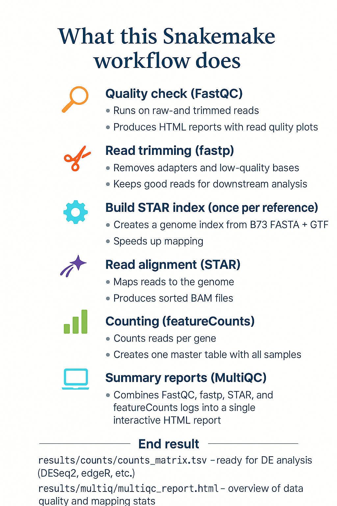

# 🧬 RNA-seq Analysis Workflow (Snakemake, STAR, featureCounts)

Welcome! 👋
This repo contains a **reproducible RNA-seq pipeline** built with [Snakemake](https://snakemake.readthedocs.io/). It takes you from **raw FASTQ files → quality control → trimming → alignment → read counts → tidy matrix** — all in one place.

The example here uses **Maize B73** as the reference genome and 24 RNA-seq samples (mock vs. two treatments, two timepoints, four biological replicates each). But you can easily swap in your own samples or organism.



## 📂 Folder structure

```bash
rna-seq/
├── Snakefile          # main workflow
├── envs/              # conda envs for tools
│   ├── qc.yaml
│   └── align.yaml
├── data/              # your raw FASTQ files go here
└── results/           # outputs (qc, bam, counts, multiqc)
```


## 🛠️ Requirements

* [conda / mamba](https://mamba.readthedocs.io/)
* [Snakemake](https://snakemake.readthedocs.io/) ≥ 7
* \~50–100 GB disk space for 24 samples
* 16+ CPU cores recommended for speed

## 🚀 Getting started

### 1. Clone this repo

```bash
git clone https://github.com/linkangit/Snakemake_RNAseq_Tutorial.git
cd Snakemake_RNAseq_Tutorial
```

### 2. Prepare input files

* Put your FASTQ files into `data/` (or update paths in the Snakefile).
* Update the `REF_FASTA` and `REF_GTF` variables at the top of the Snakefile with your reference genome.

Example (Maize B73):

```python
REF_FASTA  = "/path/to/maize_B73.fa"
REF_GTF    = "/path/to/maize_B73.gtf"
```

### 3. Install Snakemake

```bash
mamba create -n snk -c conda-forge -c bioconda snakemake=7.32 python=3.11 -y
conda activate snk
```

### 4. Run the workflow

```bash
snakemake --use-conda --cores 16
```

That’s it 🎉 — Snakemake will take care of running all steps in order.

## 📊 Outputs

After it finishes, check:

* **QC reports**

  * Raw FastQC → `results/fastqc/raw/`
  * Trimmed FastQC → `results/fastqc/trimmed/`
  * MultiQC → `results/multiqc/multiqc_report.html`

* **Alignment**

  * Sorted BAMs → `results/star/*.bam`

* **Counts**

  * Raw featureCounts output → `results/counts/featurecounts.txt`
  * Tidy counts matrix → `results/counts/counts_matrix.tsv`

## 🐍 The Snakefile

The full pipeline is implemented in the [Snakefile](./Snakefile).
👉 Open it to see all rules (QC, trimming, alignment, counting, and summary).

## ✨ Why Snakemake?

* Automates repetitive steps
* Tracks what’s done and what needs re-running
* Scales from a laptop to an HPC cluster
* Makes your science reproducible

## 🧠 Next steps

Now that you have a **counts matrix**, you can move to **differential expression analysis**.
Popular tools:

* [DESeq2 (R)](https://bioconductor.org/packages/release/bioc/html/DESeq2.html)
* [edgeR (R)](https://bioconductor.org/packages/release/bioc/html/edgeR.html)
* [PyDESeq2 (Python)](https://github.com/owkin/PyDESeq2)

## 🤝 Contributing

Feel free to fork, open issues, or submit pull requests. Suggestions for improvement are always welcome!

## 📜 Citations

If you use this workflow, please cite the original tools:

* [FastQC](https://www.bioinformatics.babraham.ac.uk/projects/fastqc/)
* [fastp](https://github.com/OpenGene/fastp)
* [STAR](https://github.com/alexdobin/STAR)
* [featureCounts](http://bioinf.wehi.edu.au/featureCounts/)
* [MultiQC](https://multiqc.info/)
* [Snakemake](https://snakemake.readthedocs.io/)
